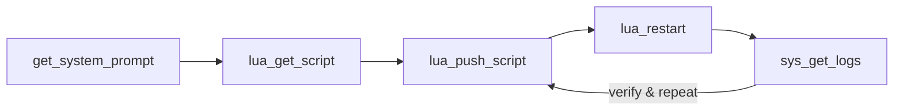
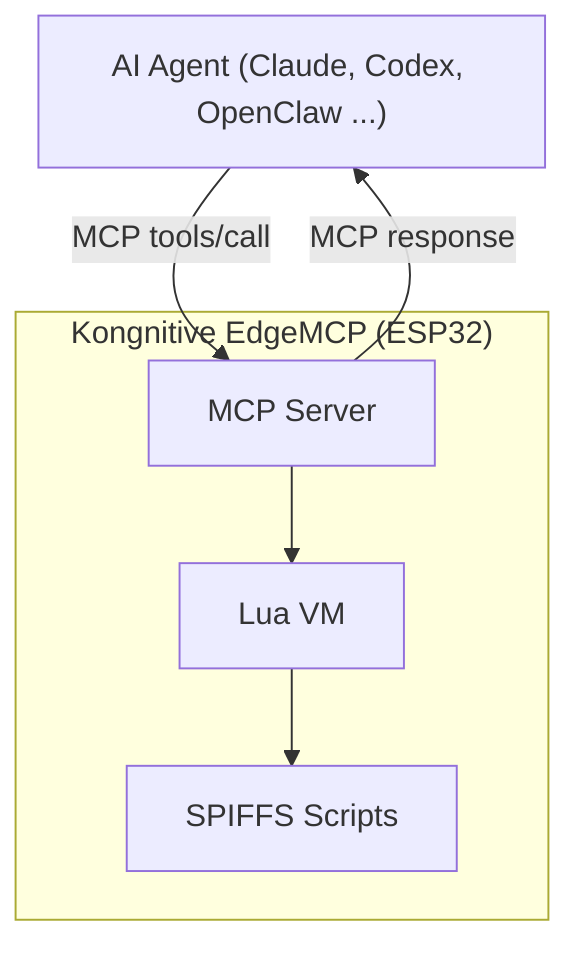

# Kongnitive EdgeMCP

Language: **English** | [Chinese (Simplified)](README.zh-CN.md)

## Meet Kongnitive EdgeMCP

**Kongnitive** = Kong + Cognitive.

An MCP base layer running on ESP32 that exposes hardware capabilities to AI. AI reads logs, pushes scripts, swaps drivers, and iterates device logic directly through MCP tools. The base layer holds steady, AI brings the intelligence.

`Kongnitive EdgeMCP` is an ESP32 MCP server with an embedded Lua 5.4 runtime.

- AI agents can update logic at runtime by writing Lua scripts to SPIFFS.
- Logic-only changes do not require firmware rebuild, reflash, or OTA.
- Firmware remains the stable runtime platform (MCP, transport, VM, drivers).

### In plain words: AI self-iteration



Firmware can be understood as the stable foundation, while Lua scripts form the hot-updatable business layer. AI iterates in a continuous closed loop through MCP tools, without repeated reflashing.

## How It Works

### Runtime model



### Recommended AI loop

1. `get_system_prompt` - load project-level operating prompt
2. `lua_list_scripts` / `lua_get_script` - inspect current script state
3. `lua_push_script` or `lua_bind_dependency` - apply logic/config update
4. `lua_restart` - restart Lua VM if needed
5. `sys_get_logs` - verify result from runtime logs

### DI injection

- `di_container.lua` provides provider registration (`provide`) and interface binding (`bind`/`resolve`).
- `bindings.lua` stores interface-to-provider mapping plus provider options.
- Provider modules (for example `provider_ssd1306.lua`, `provider_mock_display.lua`) expose factories.
- `main.lua` resolves interfaces (for example `display`) from the container at runtime.

### DI hot switch

- Use `lua_bind_dependency` to rewrite `/spiffs/bindings.lua` remotely.
- Default behavior is `restart=true`, so new binding takes effect immediately.
- For safer rollout, call with `restart=false`, then verify and run `lua_restart` manually.
- Confirm active provider with `sys_get_logs` (for example `display provider=ssd1306`).

### Built-in MCP tools (14)

- System: `control_led`, `get_status`, `get_system_prompt`, `sys_get_logs`, `sys_ota_push`, `sys_ota_status`, `sys_ota_rollback`, `sys_reboot`
- Lua: `lua_push_script`, `lua_get_script`, `lua_list_scripts`, `lua_exec`, `lua_bind_dependency`, `lua_restart`

## Quick Start

### 1) Prerequisites

- ESP-IDF v5.0+
- ESP32 development board
- USB data cable
- Verified hardware: Seeed Studio XIAO ESP32S3
- Verified I2C pins (OLED/MPU6050): SDA = GPIO5, SCL = GPIO6

### 2) Configure Wi-Fi

Edit `sdkconfig.defaults`:

```text
CONFIG_MCP_WIFI_SSID="YOUR_WIFI_SSID"
CONFIG_MCP_WIFI_PASSWORD="YOUR_WIFI_PASSWORD"
```

### 3) Build and flash

```bash
. $HOME/esp/esp-idf/export.sh
idf.py build
idf.py -p /dev/ttyUSB0 flash monitor
```

### 4) First MCP calls

```json
{"method":"tools/call","params":{"name":"get_status","arguments":{}}}
{"method":"tools/call","params":{"name":"lua_list_scripts","arguments":{}}}
{"method":"tools/call","params":{"name":"sys_get_logs","arguments":{"lines":20}}}
```

### 5) DI hot-switch example (OLED)

```json
{"method":"tools/call","params":{"name":"lua_bind_dependency","arguments":{"provider":"ssd1306","interface":"display","opts":{"addr":60,"sda":5,"scl":6,"freq":400000},"restart":true}}}
```

## FAQ

### What problem does this project solve?

This project provides a stable ESP32 MCP platform that lets AI and developers iterate device behavior quickly without repeated reflashing.

- Expose hardware capabilities through MCP tools.
- Keep firmware stable while moving fast-changing logic to Lua scripts.
- Support remote script update, restart, and log-based verification.

### Why does this project use Lua? Is Lua mandatory?

Lua is not strictly mandatory, but it is the default design choice for fast iteration:

- Firmware keeps the stable platform responsibilities (MCP, transport, drivers, OTA, safety).
- Lua scripts hold hot-updatable behavior logic.
- Many behavior changes can be applied through MCP (`lua_push_script` + `lua_restart`) without reflashing firmware.

You can implement logic directly in C firmware, but iteration speed and remote debugging convenience are typically lower.

### How much memory does Lua runtime use? How can I verify it?

It depends on the running scripts. In the default sample, it is usually in the tens of KB range (for example around 50 KB), but it can grow when scripts allocate large tables/buffers or keep global references alive.

How to verify:

- Use `get_status` to check `Lua Heap Used` and `Lua Heap Peak`.
- Use `sys_get_logs` to inspect runtime behavior and memory-related logs.
- Use `lua_list_scripts` and `lua_get_script` to inspect what is currently running on device.
- Check default script samples in `main/default_scripts/` (for example `main/default_scripts/default_main.lua`).

## For Developer

### Code layout

- `main/` - MCP server, protocol, tools, runtime, OTA, Wi-Fi
- `components/lua/` - Lua 5.4 component
- `doc/CONTRIBUTION.md` - contribution rules and PR checklist
- `MCP_AGENT_CONFIG.md` - project-level agent behavior and MCP workflow
- `doc/TODO.md` - open technical TODOs

### Configuration

- `main/Kconfig.projbuild` defines configurable keys (`MCP_WIFI_*`, message sizes, OTA URL, etc.)
- `sdkconfig.defaults` is the shared baseline config
- `sdkconfig` is intentionally local (gitignored)

### Developer expectations

- Keep code/docs in English
- Prefer runtime Lua+MCP updates for behavior changes
- Update docs when tools/workflows change
- Validate on device with `sys_get_logs`

## License

Apache License 2.0. See `LICENSE` for details.


