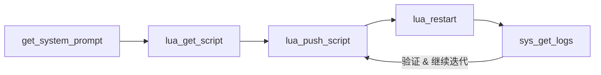
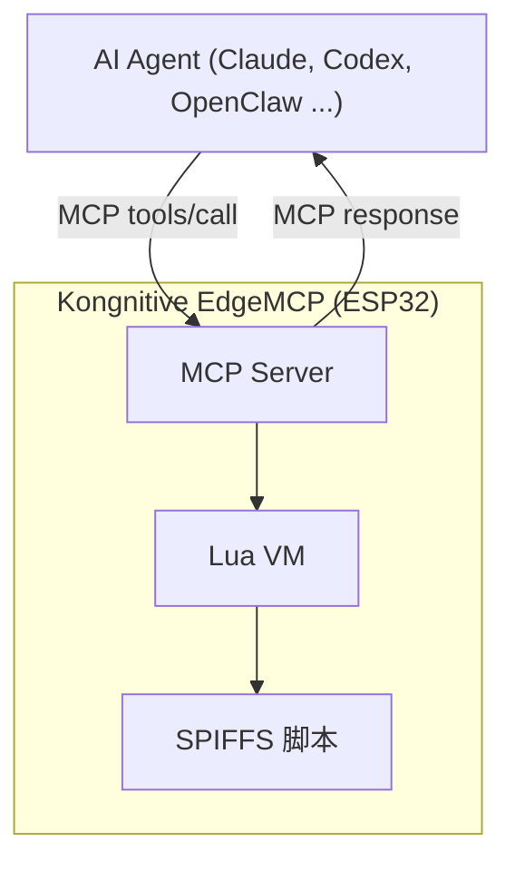

# Kongnitive EdgeMCP

语言: [English](README.md) | **简体中文**

## Meet Kongnitive EdgeMCP

**Kongnitive** — 鲲之认知。

一个跑在 ESP32 上的 MCP 基座，把硬件的能力暴露给 AI。AI 通过工具读日志、推脚本、切驱动，直接迭代设备逻辑。基座托底，AI 赋智。

`Kongnitive EdgeMCP` 是一个运行在 ESP32 上的 MCP Server，内置 Lua 5.4 运行时。

- AI 可以通过 MCP 工具直接修改 SPIFFS 中的 Lua 脚本
- 纯业务逻辑改动不需要重新编译、重新烧录或 OTA
- 固件保持稳定平台职责（MCP、传输层、Lua VM、硬件驱动）

### 通俗讲：AI 自迭代流程



可以把固件理解成“稳定底座”，把 Lua 脚本理解成“可热更新业务层”。AI 通过 MCP 工具持续闭环迭代，不需要反复烧录。

## How It Works

### 运行模型



### 推荐 AI 工作流

1. `get_system_prompt`：读取项目级系统提示词
2. `lua_list_scripts` / `lua_get_script`：查看当前脚本状态
3. `lua_push_script` 或 `lua_bind_dependency`：更新逻辑或 DI 配置
4. `lua_restart`：按需重启 Lua VM
5. `sys_get_logs`：查看日志验证结果

### DI 注入

- `di_container.lua` 提供 provider 注册（`provide`）和接口绑定（`bind`/`resolve`）。
- `bindings.lua` 持久化保存 interface -> provider 的映射及 provider 参数。
- Provider 模块（如 `provider_ssd1306.lua`、`provider_mock_display.lua`）暴露工厂函数。
- `main.lua` 在运行时从容器中解析接口（例如 `display`）。

### DI 热切换

- 通过 `lua_bind_dependency` 远程重写 `/spiffs/bindings.lua`。
- 默认 `restart=true`，写入后会立即重启 Lua VM 使新绑定生效。
- 如需稳妥发布，可先 `restart=false`，验证后再手动执行 `lua_restart`。
- 用 `sys_get_logs` 确认当前 provider（如 `display provider=ssd1306`）。

### 内置 MCP 工具（14 个）

- System：`control_led`、`get_status`、`get_system_prompt`、`sys_get_logs`、`sys_ota_push`、`sys_ota_status`、`sys_ota_rollback`、`sys_reboot`
- Lua：`lua_push_script`、`lua_get_script`、`lua_list_scripts`、`lua_exec`、`lua_bind_dependency`、`lua_restart`

## Quick Start

### 1) 前置条件

- ESP-IDF v5.0+
- ESP32 开发板
- USB 数据线
- 已验证硬件：Seeed Studio XIAO ESP32S3
- 已验证 I2C 引脚（OLED/MPU6050）：SDA = GPIO5，SCL = GPIO6

### 2) 配置 Wi-Fi

编辑 `sdkconfig.defaults`：

```text
CONFIG_MCP_WIFI_SSID="YOUR_WIFI_SSID"
CONFIG_MCP_WIFI_PASSWORD="YOUR_WIFI_PASSWORD"
```

### 3) 编译与烧录

```bash
. $HOME/esp/esp-idf/export.sh
idf.py build
idf.py -p /dev/ttyUSB0 flash monitor
```

### 4) 首次 MCP 调用示例

```json
{"method":"tools/call","params":{"name":"get_status","arguments":{}}}
{"method":"tools/call","params":{"name":"lua_list_scripts","arguments":{}}}
{"method":"tools/call","params":{"name":"sys_get_logs","arguments":{"lines":20}}}
```

### 5) OLED DI 热切换示例

```json
{"method":"tools/call","params":{"name":"lua_bind_dependency","arguments":{"provider":"ssd1306","interface":"display","opts":{"addr":60,"sda":5,"scl":6,"freq":400000},"restart":true}}}
```

## FAQ（常见问题）

### 这个项目解决什么问题？

这个项目提供了一个稳定的 ESP32 MCP 基座，让 AI 和开发者可以在不反复重刷固件的情况下快速迭代设备行为。

- 通过 MCP 工具暴露硬件能力。
- 固件保持稳定，频繁变化的逻辑下沉到 Lua 脚本。
- 支持远程脚本更新、重启和基于日志的验证闭环。

### 为什么项目要用 Lua？是必须的吗？

Lua 不是绝对必须，但它是当前默认架构选择，目的是提升迭代效率：

- 固件负责稳定平台能力（MCP、传输层、驱动、OTA、安全）。
- Lua 脚本承载可热更新的业务逻辑。
- 很多行为改动可通过 MCP（`lua_push_script` + `lua_restart`）完成，不必重刷固件。

当然也可以把逻辑直接写在 C 固件里，但迭代速度和远程调试便利性通常会下降。

### Lua runtime 占多少内存？怎么确认？

取决于当前运行脚本。默认样例通常是几十 KB（例如约 50KB）；当脚本分配较大的 table/buffer，或全局引用长期不释放时，会明显增大。

可按下面方式确认：

- 用 `get_status` 查看 `Lua Heap Used` 和 `Lua Heap Peak`。
- 用 `sys_get_logs` 查看运行日志与内存相关信息。
- 用 `lua_list_scripts` 和 `lua_get_script` 查看设备当前运行脚本内容。
- 查看仓库内默认脚本样例：`main/default_scripts/`（如 `main/default_scripts/default_main.lua`）。

## For Developer

### 代码结构

- `main/`：MCP server、协议、工具、运行时、OTA、Wi-Fi
- `components/lua/`：Lua 5.4 组件
- `doc/CONTRIBUTION.md`：贡献规范和 PR 检查项
- `MCP_AGENT_CONFIG.md`：AI Agent 项目级行为说明
- `doc/TODO.md`：技术待办

### 配置约定

- `main/Kconfig.projbuild` 定义可配置项（`MCP_WIFI_*`、消息大小、OTA URL 等）
- `sdkconfig.defaults` 作为共享基线配置
- `sdkconfig` 保持本地文件（已在 `.gitignore` 忽略）

### 开发建议

- 代码与英文主文档保持英文
- 行为变更优先采用 Lua + MCP 运行时更新
- 工具或流程变更后同步更新文档
- 在设备上通过 `sys_get_logs` 验证改动

## License

Apache License 2.0。详见 `LICENSE` 文件。


